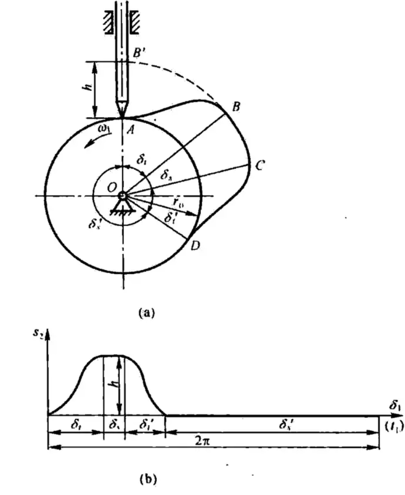
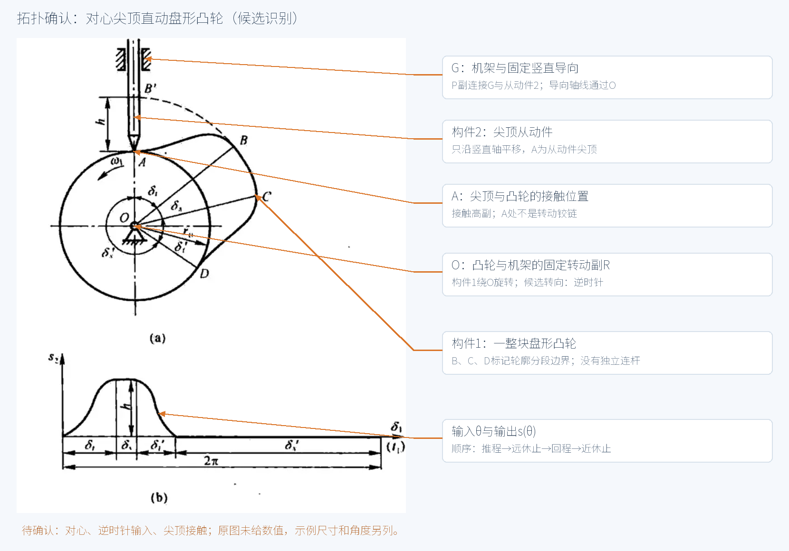
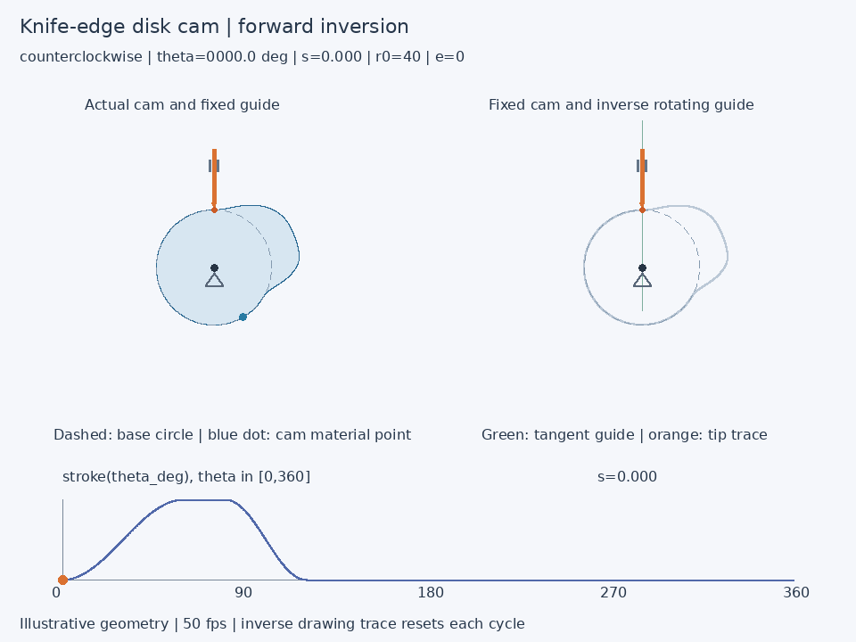

# 从课本凸轮图到运动动画：一次真实执行记录

本案例使用用户提供的对心尖顶直动盘形凸轮图。先输出带引线的拓扑确认图，用户回复“正确”，再选择教学示例尺寸、构造行程函数、采样求轮廓、生成动画并实读验收。没有从图片推测精确尺寸或原书运动规律。

## 输入图与拓扑确认





已确认：凸轮绕固定点O逆时针旋转；尖顶从动件沿经过O的竖直导轨平移；A为接触位置，不是R副；B、C、D是轮廓分段标记，没有独立连杆。凸轮—机架为R副，从动件—机架为P副，尖顶—凸轮为接触高副。

| 参数 | 本次示例值 |
|---|---|
| 基圆半径 | 40 mm |
| 升程 | 20 mm |
| 偏距 | 0 mm（对心） |
| 输入转向 | 逆时针 |
| 推程 / 远休止 / 回程 / 近休止 | 60° / 20° / 40° / 240° |
| 推程与回程 | 半余弦函数 |

## 将行程抽象成一个函数

自变量为角度数值θ∈[0,360]，行程单位为mm。几何层只调用 `stroke(theta_deg)`，不需要知道其内部是分段公式还是离散数据插值。

```math
s(\theta)=\begin{cases}
10[1-\cos(\pi\theta/60)] & 0\le\theta<60,\\
20 & 60\le\theta<80,\\
10[1+\cos(\pi(\theta-80)/40)] & 80\le\theta<120,\\
0 & 120\le\theta\le360.
\end{cases}
```

独立检查 `stroke(0)` 和 `stroke(360)`；不先取模掩盖端点。位置和速度在分段边界连续，半余弦与停歇衔接处存在加速度跳变。

## 反转法与离散轮廓

令α=πθ/180。凸轮实际逆时针转α，固定凸轮后的导杆反转角为−α。

```math
P(\theta)=\begin{bmatrix}0\\40+s(\theta)\end{bmatrix},\quad
Q(\theta)=R(-\alpha)P(\theta)=\begin{bmatrix}(40+s)\sin\alpha\\(40+s)\cos\alpha\end{bmatrix}.
```

按0.1°逐点求Q，再按角序连接为离散轮廓。恢复实际旋转满足R(α)Q=P，尖顶始终沿竖直导轨运动。对心是偏距为零的统一模型；偏置情况需旋转导杆的位置与方向，保持导杆与偏心圆相切，见[统一凸轮构造说明](../references/cam.md)。

手算：θ=30°时，s=10 mm，Q=(25,43.301270) mm；恢复旋转后P=(0,50) mm。θ=60°时行程达到20 mm，80°开始回程，120°回到基圆并停歇至360°。

## 本次真实动画与检查



左侧实际凸轮逆时针转，右侧固定凸轮、导杆顺时针反转并逐步描线；下方游标同步使用同一行程函数。基圆用虚线，蓝点为凸轮上的固定材料点。反转描线每圈清空属于作图状态。

| 检查项 | 本次执行结果 |
|---|---|
| 采样 | 3601点，0.1° |
| 最大几何残差 | 约1.43×10⁻¹⁴ mm |
| 0°—360°闭合误差 | 约9.80×10⁻¹⁵ mm |
| 轮廓半径 | 40–60 mm |
| 动画帧数 / 每帧时长 | 300 / 20 ms |
| 播放周期 | 6秒，50 fps |
| 转向与循环接缝 | 每步逆时针+1.2°，接缝+1.2° |
| GIF体积 | 807,015字节，小于5,000,000 |

几何残差仅表示数值一致性，不是加工精度。采样报告不冒充连续证明；轮廓折线是解析轮廓的近似。未进行力封闭、动力学、三维碰撞或可加工性验收。

## 可复现执行

从仓库根目录运行：

```bash
python -m pip install -r requirements.txt
python docs/cam-example/reproduce.py
python -m unittest discover -s scripts -p 'test_*.py'
```

复现脚本调用现有 `cam.py`、`run_cam.py`，输出到 `output/cam-example`。几何复用 `linkage.rotation`，动画复用 `run_model.save_gif_under_limit`，没有独立重写旋转和压缩逻辑。导向符号放在从动件整周都能穿过的位置。

- [本次行程函数](cam-example/stroke.py)
- [每10°坐标](cam-example/coordinates_10deg.csv)
- [0.1°离散轮廓](cam-example/profile_0.1deg.csv)
- [实际验证结果](cam-example/verification.json)
- [复现脚本](cam-example/reproduce.py)

重新执行后的GIF字节数可能随Pillow版本改变；应以实读帧数、时长、转向、循环与体积验收为准。新机构图仍需独立拓扑确认。
