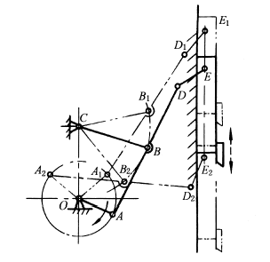
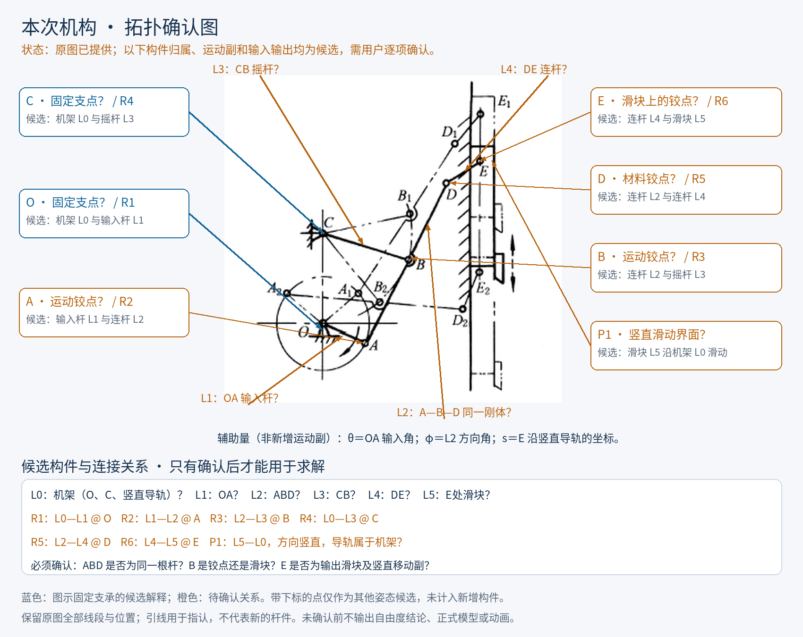
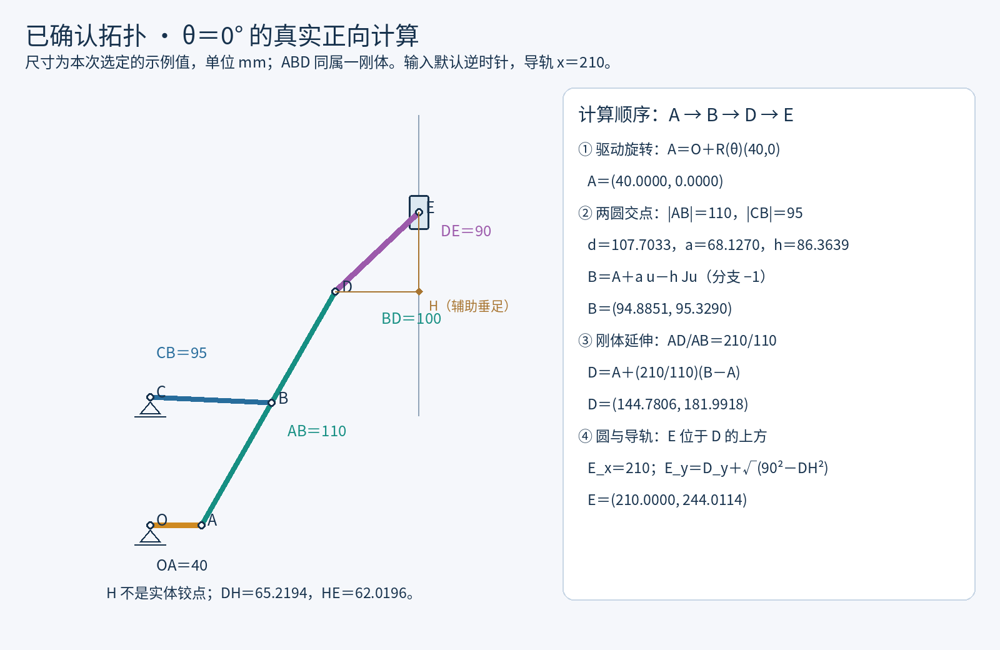
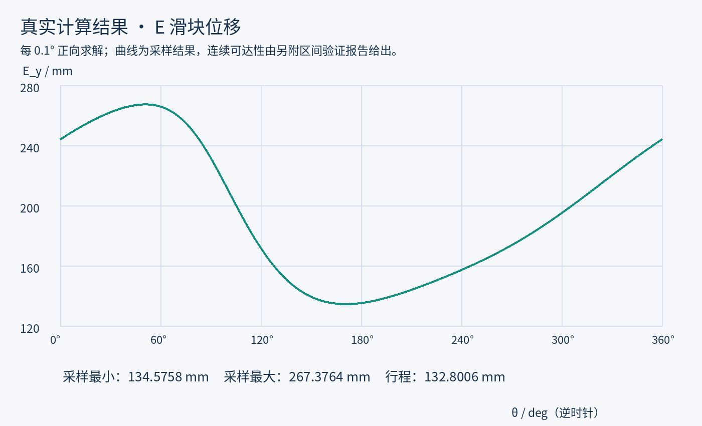
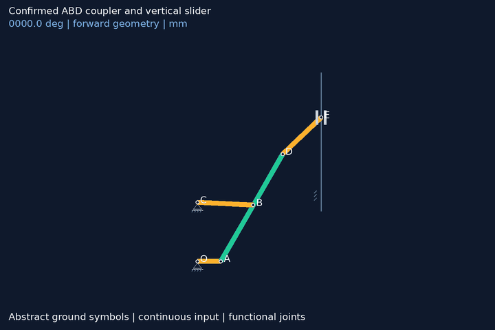

# 实际调用与验证记录：ABD 连杆驱动竖直滑块

本页记录 2026-10-03 实际调用 `$solve-planar-linkages` 分析用户机构图的完整过程。
先生成拓扑确认图，收到用户回复“正确”，再选择示例尺寸、正向求解、验证整周运动、生成动画；全部检查通过后才上传本指南。
本次没有原机器尺寸，以下结论只适用于给出的示例模型，不是对原机器的工程验收。

## 1. 实际输入与拓扑确认



以下为确认前实际生成的第一阶段标注图。问号反映当时的待确认状态。



用户回复“正确”，确认紧邻的关系清单：O、C 固定；OA 为输入曲柄；ABD 是同一根刚性连杆；CB 为独立摇杆；B 是转动铰点；DE 为独立连杆；E 为沿固定竖直导轨运动的滑块铰点；带下标的点表示其他姿态。
输入转向没有被单独指定，本次明确选用逆时针作为示例约定，θ 从世界坐标 +x 方向起算。

| 构件 | 已确认归属 |
|---|---|
| L0 机架 | O、C 固定支点及竖直导轨 |
| L1 曲柄 OA | O、A |
| L2 刚性连杆 ABD | A、B、D；B 在 A 与 D 之间 |
| L3 摇杆 CB | C、B |
| L4 连杆 DE | D、E |
| L5 输出滑块 | E；与 L0 构成竖直移动副 |

| 运动副 | 已确认连接 |
|---|---|
| R1：O | L0—L1 |
| R2：A | L1—L2 |
| R3：B | L2—L3 |
| R4：C | L0—L3 |
| R5：D | L2—L4 |
| R6：E | L4—L5 |
| P1：竖直导向 | L5—L0 |

计入机架共有 6 个构件、6 个 R 副与 1 个 P 副，常规平面低副自由度计数为 3×5−2×7＝1。
该计数是结构检查，连续可达性仍由后续几何分析与区间验证给出。

## 2. 实际选用的示例尺寸

| 参数 | 值 / mm | 来源 |
|---|---:|---|
| O | (0,0) | 示例坐标基准 |
| C | (0,100) | 示例固定支点 |
| OA | 40 | 示例输入半径 |
| AB | 110 | 示例连杆段 |
| BD | 100 | 示例延伸段 |
| AD | 210 | AB＋BD，非独立尺寸 |
| CB | 95 | 示例摇杆长 |
| DE | 90 | 示例输出连杆长 |
| 竖直导轨 | x＝210 | 示例位置 |
| 导轨有限范围 | 85≤y≤320 | 示例接合范围 |
| 滑块轴向长度 | 24 | 用完整长度检查接合 |
| 运动杆宽 / 通孔宽 | 8 / 10 | 单侧间隙 1 |

尺寸没有从图片比例读取。
固定 B 的局部位置是用户确认 ABD 刚体归属后的建模结果；没有把 B 当作沿杆滑动的套筒。
初始选用参数即通过本次验证，没有进行尺寸迭代，也不声称全局最优。

## 3. 实际正向求解：A → B → D → E



### 第一步：旋转矩阵生成 A

```math
R(\theta)=\begin{bmatrix}\cos\theta&-\sin\theta\\\sin\theta&\cos\theta\end{bmatrix},\qquad
A=O+R(\theta)\begin{bmatrix}40\\0\end{bmatrix}.
```

### 第二步：由两圆交点得到 B

圆心分别为 A、C，半径分别为 AB＝110、CB＝95。

```math
d=\|C-A\|,\quad u=\frac{C-A}{d},\quad
J=\begin{bmatrix}0&-1\\1&0\end{bmatrix},
```

```math
a=\frac{110^2-95^2+d^2}{2d},\quad h=\sqrt{110^2-a^2},\quad
B=A+a u-hJu.
```

本次初始装配选分支 −1，保持 B 在从 A 指向 C 的右侧，不逐帧换根。

### 第三步：同一刚体位姿给出 D

以 A 为局部原点，B 的局部坐标为 (110,0)，D 为 (210,0)。

```math
Q=[v,Jv],\quad v=\frac{B-A}{110},\qquad
D=A+Q\begin{bmatrix}210\\0\end{bmatrix}
 =A+\frac{210}{110}(B-A).
```

该表达保持 AB、BD、AD 不变及 ABD 共线；不是另设一根自由转动的 BD 杆。

### 第四步：圆与竖直导轨得到 E

令辅助垂足 H＝(210,D_y)，H 不是实体铰点，不计入构件和运动副。

```math
E_x=210,\qquad E_y=D_y+\sqrt{90^2-(210-D_x)^2}.
```

本次保留 E 位于 D 上方的装配分支 +1。
以上均为顺序几何构造，未使用数值方程求解器。

### 实际手算对照：θ＝0°

| 点/中间量 | 本次计算结果 |
|---|---|
| A | (40.0000, 0.0000) mm |
| d / a / h | 107.7033 / 68.1270 / 86.3639 mm |
| B | (94.8851, 95.3290) mm |
| D | (144.7806, 181.9918) mm |
| DH / HE | 65.2194 / 62.0196 mm |
| E | (210.0000, 244.0114) mm |

## 4. 完整周期验证的真实结果

### 连续几何可达性

因为 OC＝100、OA＝40，整周有 d∈[60,140]。
严格满足 |110−95|＝15＜60 且 140＜110＋95＝205，所以两圆整周相交且不会相切。

对于下游 D—E 闭环和有限导轨接合，本次使用 mpmath 区间算术（30 位十进制精度），以 3600 个闭区间覆盖 [0,2π]。
每个角区间中对整个区间的坐标和根号内项进行包围计算，不是只检查 3600 个离散角度。
导出的浮点包围界额外向外扩张 10⁻⁹ mm。

| 连续包围/下界 | 本次结果 |
|---|---:|
| D_x 连续包围 | [141.158845, 186.221604] mm |
| D_y 连续包围 | [55.694245, 198.244117] mm |
| E_y 连续包围 | [134.006028, 268.073337] mm |
| 两圆高度平方 h² 下界 | 5541.859590 mm² |
| 输出根号内项下界 | 3360.895344 mm² |
| 滑块完整轴向接合余量下界 | 37.006028 mm |
| 单侧间隙 | 1 mm |

两个根号内项始终严格为正，固定分支连续；对滑块检查的是 [E_y−12,E_y＋12]，完整区间始终包含在导轨 [85,320] 内。
结果见 [continuous-proof.json](verified-example/continuous-proof.json)。
内置采样报告仍保留 `continuous_reachability_proven: false`；没有改写采样报告冒充证明，连续结论来自独立报告。

### 采样与独立一致性检查

| 检查项 | 本次结果 |
|---|---:|
| 全周采样 | 0.1°，3601 个姿态 |
| 最大杆长/运动副残差 | 5.684e-14 mm |
| 0°—360°闭合误差 | 9.797e-15 mm |
| ABD 共线叉积最大误差 | 5.457e-12 mm² |
| B 固定分支有向面积最小值 | 5693.952384 mm² |
| 整体平移/旋转后的最大一致性误差 | 1.511e-13 mm |
| 采样最小轴向接合余量 | 37.575781 mm |

采样杆长、导轨共线、刚体共线、固定分支、周期闭合及整体平移/旋转检查均通过。
浮点残差反映计算一致性，不代表实际加工精度。
结果见 [verification.json](verified-example/verification.json) 和 [additional-verification.json](verified-example/additional-verification.json)。



采样 E_y 范围为 134.575781～267.376392 mm，行程约 132.800611 mm。
采样极小/极大对应输入角约 170.9° / 50.9°。
这组极值是采样结果，不把它们称作解析精确极值。

## 5. 实际生成的流畅动画



| 动画检查 | 本次结果 |
|---|---:|
| 每圈帧数 | 300 |
| 每帧时长 | 20 ms |
| 每圈播放时长 | 6 s |
| 曲柄每帧步长 | 1.2° |
| 末帧→首帧步长 | 1.200000000000° |
| GIF 实读体积 | 1,182,373 字节，低于 5,000,000 |
| 画布 | 720×480 |

每帧重新正向求解，未抽帧、未跳过无效姿态、未逐帧换根，也未重复添加360°终点帧。
用均匀输入 θᵢ＝360°·i/300，i＝0,…,299 构成完整周期。
动画采用最简固定支承，绿色 ABD 仅表达一个已确认刚体；E 沿竖直导轨运动。

## 6. 实际交付与复现

- [本次模型 JSON](verified-example/model.json)
- [每10°坐标 CSV](verified-example/coordinates_10deg.csv)
- [采样及动画验证 JSON](verified-example/verification.json)
- [连续区间验证 JSON](verified-example/continuous-proof.json)
- [附加一致性检查 JSON](verified-example/additional-verification.json)
- [复现脚本](verified-example/reproduce.py)

在仓库根目录运行：

```bash
python -m pip install -r requirements.txt
python docs/verified-example/reproduce.py
```

只复现内置正向采样与动画（不运行独立区间证明）可执行：

```bash
python scripts/run_model.py docs/verified-example/model.json --out output/verified-example --gif
```

本次已完成声明尺寸下的平面运动学、连续几何可达性、有限导轨接合、刚体/装配分支、坐标数据及 GIF 验证。
未进行三维实体碰撞、强度、速度/加速度或负载验证，不把运动学验证扩展成这些结论。
